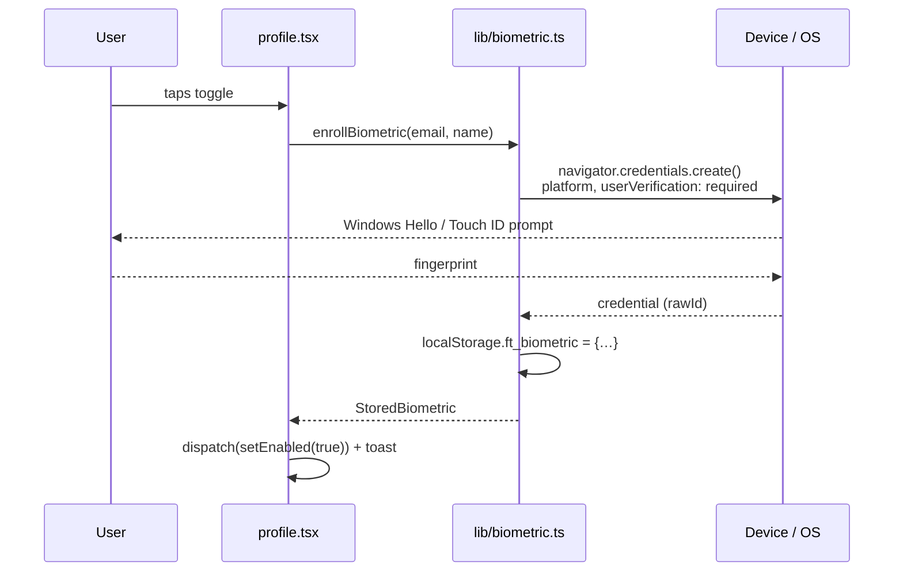
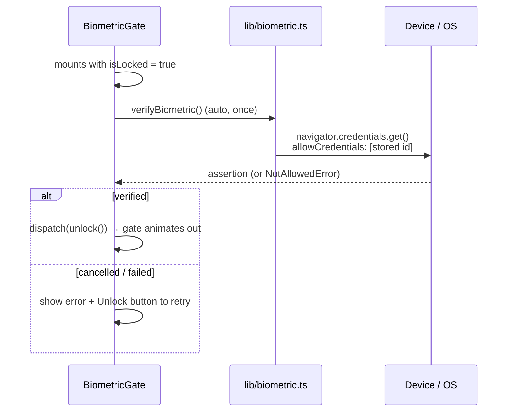

# Biometric Unlock — How It Works

Fingerprint / face unlock on the FinTrack profile page, built on **WebAuthn platform
authenticators** (Windows Hello, Touch ID, Android biometric).

> **Scope:** this is a client-side UI lock. There are **no backend changes** — nothing in
> the Flask or Spring Boot API, no new tables, no migrations. See
> [Security model](#security-model) for exactly what it does and does not protect.

---

## Files

| File | Role |
|---|---|
| `lib/biometric.ts` | WebAuthn wrapper + localStorage persistence |
| `store/biometricSlice.ts` | Redux state (`enabled`, `isLocked`, `isSupported`) |
| `store/index.ts` | Pre-hydrates the lock before first paint |
| `components/BiometricGate.tsx` | The lock screen + re-lock timer |
| `pages/_app.tsx` | Wraps the app in the gate |
| `pages/profile.tsx` | The on/off toggle |
| `types/index.ts` | `BiometricState` |
| `components/ConfirmDialog.tsx` | Gained an optional `confirmLabel` prop |

---

## What gets stored

**Only a credential ID.** The fingerprint itself never reaches the browser — it is matched
inside the device's secure hardware, which returns a yes/no. The private key is generated
in that hardware and cannot be exported.

Browser `localStorage`, key `ft_biometric`:

```json
{
  "enabled": true,
  "credentialId": "AX7k9…",
  "userEmail": "you@example.com"
}
```

`userEmail` binds the credential to one account — see [Account switching](#account-switching).

> The user model has no `id` field (`UserSchema` in `types/index.ts` is keyed on email), so
> email is the binding key. If an `id` is added later, switch the binding to it.

---

## Redux state

```ts
interface BiometricState {
  enabled: boolean;      // a credential is enrolled in this browser
  isLocked: boolean;     // gate is up; app must not be usable
  isSupported: boolean;  // device has a user-verifying platform authenticator
}
```

`resetStore` (dispatched on logout) resets `enabled` and `isLocked` but **keeps
`isSupported`**, since device capability doesn't change when you sign out.

---

## Flow 1 — Enabling it



The switch **only flips after the OS confirms**. Cancel, timeout, or an unsupported device
leaves it off and shows an error toast — never a half-enabled state.

Nothing locks at this point. You keep using the app normally for the rest of the session.

---

## Flow 2 — The lock going up

Two triggers.

### App re-entry (page load / reopening the PWA)

`store/index.ts` runs at module scope, **before React renders**:

```ts
const hasToken = !!localStorage.getItem('ft_token');
const biometricEnabled = !!readBiometric()?.enabled;

biometric: {
  enabled:  biometricEnabled,
  isLocked: biometricEnabled && hasToken,
  isSupported: false,
}
```

Because this happens pre-render, the gate is already up on the first paint — balances never
flash on screen before the lock appears.

**`&& hasToken` is deliberate.** A token existing at load time means you're *re-entering* an
existing session. A fresh password login has no token at load, so `isLocked` stays `false`
and you aren't asked for a fingerprint seconds after typing your password.

### Returning to a backgrounded tab

`BiometricGate` listens for `visibilitychange`, records when the tab was hidden, and
dispatches `lock()` if it was hidden longer than `RELOCK_AFTER_MS` (5 minutes).

---

## Flow 3 — Unlocking



While locked, the app is kept mounted but sealed off:

```tsx
<div aria-hidden={showGate} className={showGate ? 'blur-xl pointer-events-none select-none' : undefined}>
  {children}
</div>
```

Blurred, click-through disabled, and hidden from screen readers. The overlay sits at
`z-[300]`, above modals (`z-[200]`).

The prompt fires **automatically on mount** (guarded by an `autoPrompted` ref so a re-render
can't double-fire it) — no extra tap needed in the common case.

### The escape hatch

**"Sign in with password instead"** clears the credential, logs out, and redirects to
`/auth/login`.

This is not optional polish. If you reset Windows Hello, wipe the device credential, or
change your fingerprint enrollment, `verifyBiometric()` can never succeed again — without
this button the app would be permanently unusable in that browser.

---

## Flow 4 — Disabling it

Toggle off → `ConfirmDialog` ("Disable biometric unlock?", confirm label `Disable`) →
`clearBiometric()` removes `ft_biometric` → `setEnabled(false)`, which also forces
`isLocked = false` so the gate can't be left stranded up.

The credential stays registered with your OS but is orphaned and never referenced again.

---

## Edge cases handled

### Account switching

If a **different** account signs in on the same browser, `BiometricGate` compares
`stored.userEmail` against the logged-in user and, on mismatch, wipes the enrollment rather
than gating the new user with a credential that isn't theirs.

### Re-login as the same user

Logout resets the slice, but `ft_biometric` survives in localStorage. On logging back in as
the same user, the gate restores `enabled: true` — while leaving `isLocked: false`, so the
fresh login isn't immediately re-gated.

### Unsupported devices

`isBiometricSupported()` checks three things:

```ts
window.isSecureContext                                          // HTTPS or localhost
window.PublicKeyCredential                                      // API exists
PublicKeyCredential.isUserVerifyingPlatformAuthenticatorAvailable()
```

If any fail, the profile toggle renders disabled with *"Not available on this device or
browser."*

---

## PWA / mobile notes

Works well installed as a PWA — the standalone window gets the same treatment, and app
re-entry triggers the lock exactly as a browser reload does.

**WebAuthn requires a secure context.** Installed PWAs are served over HTTPS, so this is
fine in production. But a LAN dev server (`http://10.71.159.28:3000`) is *not* a secure
context, so the toggle correctly reports unsupported there. To test on a phone against a
local backend, tunnel it:

```bash
ngrok http 3000
# then add the https tunnel URL to CORS_ORIGINS in backend/.env and restart Flask
```

**The credential is per-browser-profile, per-device.** Enrolling on your phone does nothing
for your laptop; each device enrolls separately. There is currently no server-side record,
so the profile page cannot list or remotely revoke other devices.

---

## Security model

**What it stops:** someone picking up your unlocked phone or walking up to your unlocked
laptop and opening FinTrack.

**What it does not stop:** anyone with the device and technical intent. Because no server
verifies the assertion, the JWT stays in `localStorage` while the gate is up — it can be
read via devtools and used against the API directly, or `ft_biometric` can simply be
deleted to drop the gate.

This is the same trust level as the existing `privacyMode` figure masking: a UI-level
protection, not an authentication factor.

### Making it real (Phase 2, not implemented)

Turning this into an actual auth factor requires backend work:

1. A `biometric_credentials` table — `user_id`, `credential_id`, `public_key`, `sign_count`.
2. Endpoints `POST /api/auth/webauthn/register/{begin,complete}` and
   `/login/{begin,complete}`, using `py_webauthn` in Flask.
3. Server-issued challenges and server-verified assertions; the JWT is only released after
   verification.
4. The same work mirrored in the Spring Boot backend, or the two will disagree.

`lib/biometric.ts` would swap its local challenge/verify for those API calls. The slice,
the gate, and the profile UI stay as they are.

That table would also give you per-device tracking and remote revoke — the thing a single
`users.biometric_enabled` boolean can't do safely, since a per-account flag would lock you
out on any device that never enrolled.
