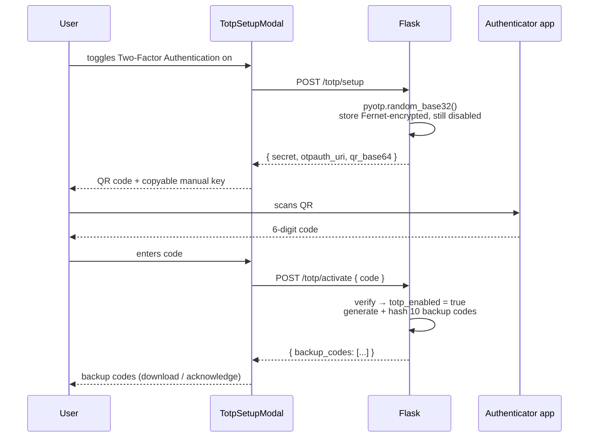

# Two-Factor Authentication (TOTP) — How It Works

Authenticator-app 2FA (Google Authenticator, Authy, 1Password) across the Flask backend and
the Next.js frontend.

> **Unlike [biometric unlock](./BIOMETRIC.md), this is real authentication.** The code is
> verified server-side against a secret only the backend can decrypt, and no session token
> is issued until it checks out. Biometric unlock is a UI gate; this is an auth factor.

---

## Files

### Backend (Flask)

| File | Role |
|---|---|
| `app/services/totp_service.py` | Enrolment, code verification, backup codes, login challenge |
| `app/core/security.py` | `encrypt_secret` / `decrypt_secret` (Fernet) |
| `app/models/user.py` | 7 new columns on `users` |
| `app/schemas/user.py` | Request/response schemas, `UserResponse.totp_enabled` |
| `app/api/auth.py` | 4 new endpoints + the `/login` branch |
| `app/services/auth_service.py` | `login` branches to a challenge; `verify_mfa` |
| `migrations/versions/dd6d2dc2dc38_*.py` | The migration |

**Dependencies added:** `pyotp`, `qrcode[pil]`, `cryptography`.

### Frontend (Next.js)

| File | Role |
|---|---|
| `components/TotpSetupModal.tsx` | QR → confirm code → backup codes |
| `pages/profile.tsx` | Toggle + password-confirm disable dialog |
| `pages/auth/login.tsx` | Second login step |
| `store/authSlice.ts` | `login` branches on `mfa_required`; `verifyMfa` thunk |
| `types/index.ts` | `totp_enabled` on `UserSchema` |

---

## Database schema

Seven columns on `users`, all additive — existing rows default to `totp_enabled = false`,
so accounts that never opt in log in exactly as before.

```python
totp_secret          String(255)   # base32 TOTP secret, Fernet-encrypted
totp_enabled         Boolean       # default false
totp_confirmed_at    DateTime(tz)
totp_backup_codes    Text          # JSON array of sha256 hashes

mfa_challenge_token   String(128)  # sha256 of the pending-login token, indexed
mfa_challenge_expires DateTime(tz)
mfa_attempts          Integer      # default 0
```

`totp_secret` present with `totp_enabled = false` means setup was started but never
confirmed — harmless, and overwritten on the next setup attempt.

---

## Configuration

`app/core/config.py`, all overridable via `.env`:

| Setting | Default | Meaning |
|---|---|---|
| `TOTP_ISSUER` | `FinTrack` | Name shown in the authenticator app |
| `MFA_CHALLENGE_EXPIRES_MINUTES` | `5` | Life of a pending login |
| `MFA_MAX_ATTEMPTS` | `5` | Wrong codes before the challenge is burned |
| `BACKUP_CODE_COUNT` | `10` | Codes issued at activation |

---

## API reference

| Method | Endpoint | Auth | Purpose |
|---|---|---|---|
| POST | `/api/auth/totp/setup` | JWT | Generate secret, return QR + manual key |
| POST | `/api/auth/totp/activate` | JWT | Confirm code, enable 2FA, return backup codes |
| POST | `/api/auth/totp/disable` | JWT + password | Turn 2FA off |
| POST | `/api/auth/login/verify` | — | Second login step (`mfa_token` + `code`) |

`POST /api/auth/login` now has two possible 200 responses:

```jsonc
// 2FA off — unchanged
{ "access_token": "…", "refresh_token": "…", "token_type": "Bearer", "user": { … } }

// 2FA on — note: no tokens
{ "mfa_required": true, "mfa_token": "…", "message": "Enter the code from your authenticator app." }
```

---

## Flow 1 — Enabling 2FA



Two deliberate details:

**Setup is not enabling.** `/totp/setup` stores a secret but leaves `totp_enabled` false. 2FA
only switches on after `/totp/activate` proves the app is actually generating correct codes —
otherwise a mis-scanned QR would lock the user out on next login.

**The `Done` button is disabled** until the user ticks "I have saved these codes." Backup
codes are hashed server-side and can never be shown again.

---

## Flow 2 — Logging in with 2FA

```mermaid
sequenceDiagram
    participant U as User
    participant L as login.tsx
    participant API as Flask

    U->>L: email + password
    L->>API: POST /api/auth/login
    API->>API: password OK, totp_enabled → start_challenge()
    API-->>L: { mfa_required: true, mfa_token }
    Note over L: no token stored; auth.user stays null
    L-->>U: 6-digit code step
    U->>L: code (or a backup code)
    L->>API: POST /api/auth/login/verify { mfa_token, code }
    API->>API: verify TOTP, else consume backup code<br/>clear challenge
    API-->>L: { access_token, refresh_token, user }
    L->>L: setToken() → redirect to /
```

The `login` thunk resolves to `{ mfaToken }` instead of a `User` in this case, and the
reducer explicitly skips assigning `state.user`:

```ts
.addCase(login.fulfilled, (state, action) => {
  state.isLoading = false;
  // A 2FA challenge is not a session — leave `user` null until verifyMfa.
  if (!('mfaToken' in action.payload)) {
    state.user = action.payload;
  }
})
```

If the challenge is burned (too many wrong codes, or expired), the error message contains
*"sign in again"* and the UI drops back to the password step.

---

## Flow 3 — Recovery with a backup code

`/login/verify` accepts a backup code in the same `code` field. The service tries TOTP
first, then falls back to matching a stored hash. A consumed code is **removed from the
array**, so it cannot be replayed.

Backup codes look like `a3f1-9c02` — two hex groups, matched case-insensitively.

---

## Flow 4 — Disabling 2FA

Toggle off → dialog asking for the **account password** → `POST /totp/disable` → secret,
backup codes, and any pending challenge are all cleared → `restoreSession()` refreshes
`user.totp_enabled` so the switch flips.

The password requirement is the point: a stolen access token alone cannot strip the second
factor. This is also why it doesn't reuse `ConfirmDialog` — that component has no input.

---

## Security decisions

**The TOTP secret is encrypted at rest.** Fernet, with the key derived as
`sha256(SECRET_KEY)`. A database dump alone does not hand over everyone's second factor.
*Trade-off:* rotating `SECRET_KEY` makes existing secrets undecryptable and forces every
2FA user to re-enrol. `decrypt_secret` returns `None` rather than raising in that case.

**The MFA challenge token is opaque and DB-backed, not a JWT.** A short-lived JWT would be
accepted by any `@jwt_required()` endpoint, meaning a half-finished login could read
transactions. A random `secrets.token_urlsafe(32)`, stored sha256-hashed in
`mfa_challenge_token`, cannot be mistaken for an access token by anything.

**Verification is rate-limited.** Six digits is only 1,000,000 combinations — unthrottled,
that is brute-forceable. `mfa_attempts` increments per failure and the challenge is
destroyed at `MFA_MAX_ATTEMPTS`, forcing the attacker back through the password step. The
remaining count is surfaced to the user ("Incorrect code. 3 attempt(s) remaining.").

**Clock drift is tolerated, but narrowly.** `valid_window=1` accepts the adjacent 30-second
steps — enough for a phone whose clock is slightly off, while a code from five minutes ago
is rejected.

**Backup codes are hashed and single-use.** Stored as sha256, never recoverable, removed
from the array on use.

**Error messages are vague on purpose.** An expired and a non-existent challenge return the
same "This login attempt has expired" text.

---

## Verified behaviour

17 logic checks pass against the real crypto (`encrypt_secret`, `pyotp`, `_consume_backup_code`):

- secret round-trips through encryption; ciphertext fits `String(255)`
- undecryptable ciphertext returns `None` instead of raising
- valid code accepted, wrong code rejected, whitespace tolerated
- previous 30s step accepted (drift); a 5-minute-old code rejected
- a code from a different secret is rejected
- a backup code works once, then fails; a second code still works
- `NULL` or malformed `totp_backup_codes` returns `False` rather than raising

The full HTTP round-trip has not been exercised end-to-end, as that would require creating
a user in the live Neon database.

---

## Known gaps

**The Spring Boot backend has none of this.** Its `/api/auth/login` still returns tokens
immediately, so pointing the frontend at it bypasses 2FA entirely. Either port the feature
or keep that backend off the login path.

**One challenge per user.** `mfa_challenge_token` is a single column, so starting a second
login invalidates the first. Fine in practice; worth knowing if you test from two devices at
once.

**`/totp/activate` is not rate-limited** the way `/login/verify` is. Lower risk — it needs a
valid session already — but it is an asymmetry.

**No "regenerate backup codes" endpoint.** Once used up, the only way to get more is to
disable and re-enable 2FA.

---

## Interaction with biometric unlock

They are independent and complementary:

| | Biometric unlock | TOTP 2FA |
|---|---|---|
| Verified by | The device, locally | The server |
| Protects | Opening the app on an unlocked device | Signing in from anywhere |
| Backend involvement | None | Required |
| Bypassable client-side | Yes | No |

TOTP is also what makes the passwordless direction sketched in `BIOMETRIC.md` viable: it is
a device-independent recovery factor, so losing the phone holding a WebAuthn credential
does not mean losing the account.
